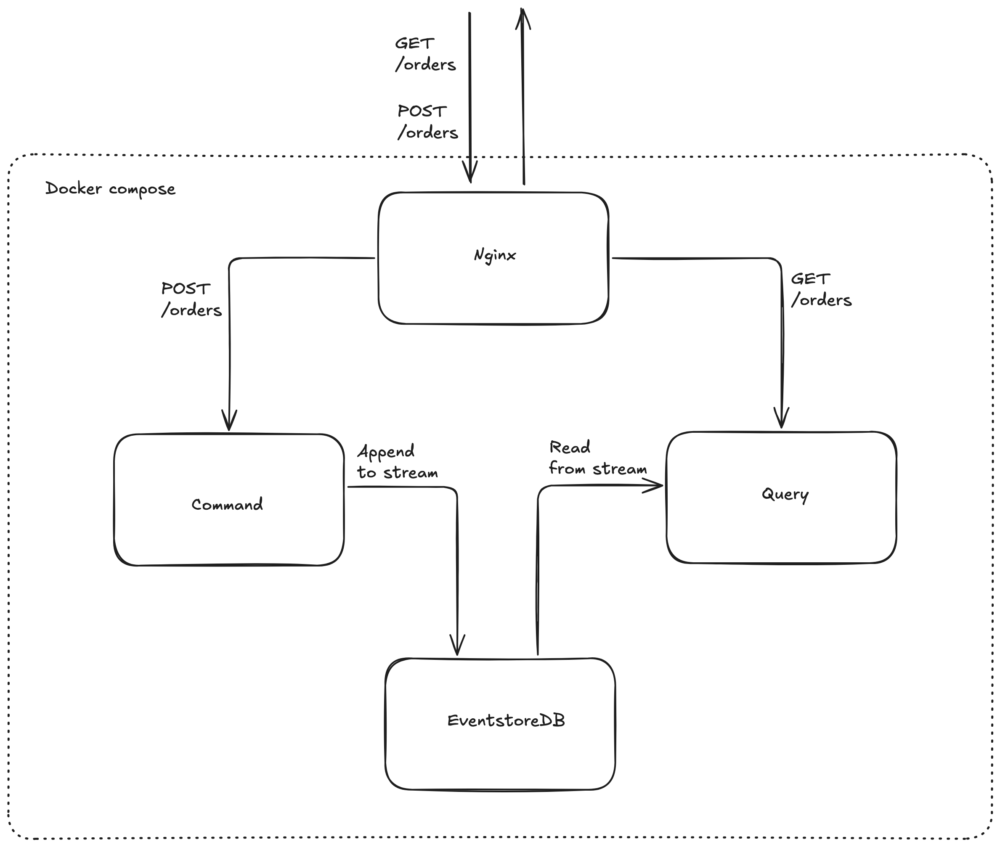

# A demonstration of how CQRS design could work.

## Overview of the services and the data and event flow



## How to run the project locally

### Prequisites:

1. Docker and Docker Compose installed

### Steps:

1. Change to the project's root directory and open terminal

2. Run the following command:

```
docker compose -f docker-compose-dev.yaml up --build
```

3. Wait for all services up and running, you will see 4 services: **eventstore.db**, **nginx**, **command** and **query**

4. The services will be served in one localhost domain: http://localhost:3639

Endpoints:
- POST    /orders
  Body
  ```
  {
    name: string,
    productId: string,
    totalAmount: number
  }
  ```

- PUT     /orders/:id
  Body
  ```
  {
    name: string,
    productId: string,
    totalAmount: number
  }
  ```

- DELETE  /orders/:id
- GET     /orders

5. You could check the log in the terminal where your docker compose is running to observe the events appended to stream.
